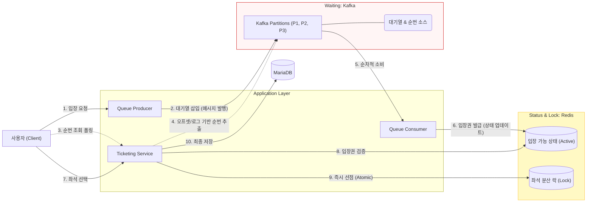

# concert-reservation-service

## 가. 개요

### 1. 프로젝트 요약

- 대기실 시스템을 통한 공정한 예매 기회 제공과 안정적인 좌석 선점 처리를 보장하며, 모의 결제 프로세스를 통해 실제 티켓 예매 사이트의 핵심 기능을 구현한 시스템

### 2. 개발 기간

- 2024-11-14 ~ 2024-11-21

---

### 3. 저장소 안내
현재 저장소는 현재 프로젝트의 초기 구현 코드가 담긴 레거시 저장소입니다.
이후 대기열 및 좌석 선점 로직의 동시성과 정합성 제어 구조를 보완하여 새 저장소에서 작업을 이어가고 있습니다. 
개선된 최신 구조와 소스코드는 아래 저장소에서 보실 수 있습니다.

#### 저장소 바로가기
- [Waiting Queue Service](https://github.com/shshinbox/waiting-queue-service): Redis ZSet 기반 대기열 서비스
- [Seat Holding Service](https://github.com/shshinbox/seat-holding-service): Redis 기반 동시성 제어와 Kafka 기반 예약 발급
- [Reservation Service](https://github.com/shshinbox/reservation-service): Kafka 기반 예약 생성 분리와 예약 상태 관리


### 4. 현 프로젝트의 한계

#### 4.1. 저장소 책임 집중

* 대기열, 좌석, 예약을 하나의 저장소에서 관리
* 도메인 간 책임이 분리되지 않아 유지보수와 확장이 어려움

> **개선**
>
> * 대기열 → 좌석 → 예약 단계별 저장소 분리

#### 4.2. Kafka 기반 대기열

* 3개 파티션의 Offset을 기반으로 대기 순번을 추정 방식으로 정확성이 떨어짐
* Offset은 대기열 순번 조회용 자료구조가 아니므로 단순 대기열에 Kafka는 과한 선택이었다고 판단

> **개선**
>
> * 정확한 순번 조회가 가능한 대기열 구조로 변경

#### 4.3. 좌석 선점

* TTL + Key 기반으로만 좌석 선점 관리
* 사용자의 다중 좌석 선택을 고려하지 못한 설계

> **개선**
>
> * 사용자 단위 상태를 함께 관리하도록 개선

#### 4.4. 중복 입장

* 동일 사용자의 다중 브라우저·탭 진입을 고려하지 않음

> **개선**
>
> * 사용자당 하나의 입장 권한만 허용하도록 설계


---
---

### 5. 기술 스택

- backend: Java 21, Spring Boot 3.3
- db: Redis, MariaDB
- messaging: Kafka
- ORM: JPA, Hibernate
- build: Maven
- test: JUnit 5, Mockito


### 6. 아키텍처




### 7. ERD


## 나. 기능 설명

### **주요 구현 내용**

#### 1. JWT 인증
- OncePerRequestFilter를 활용해 JWT 인증 시스템 설계
- HandlerMethodArgumentResolver와 결합하여 사용자 정보를 Controller에서 유연하게 활용할 수 있는 구조 구축

#### 2. 대기열 처리
- 대기 상태(pending)는 Kafka로 트래픽 분산 처리
- polling으로 상태 확인 유도

#### 3. 좌석 선점
- Redis를 사용하여 좌석 선점 시 유일성 보장

#### 4. 에러 처리
- 예외는 @ExceptionHandler를 통해 일괄적으로 처리, 가독성 및 유지보수성 강화

### **주요 API 요약**

| Method   | Endpoint                                              | 설명                           |
|----------|-------------------------------------------------------|------------------------------|
| `POST`   | `/reservation/pending`                                | 예약 진입                        |
| `GET`    | `/reservation/pending/request-id/{requestId}/details` | 예약 진입 상태 및 결과 조회             |
| `POST`   | `/reservation/preoccupy`                              | 좌석 선점                        |
| `PATCH`  | `/reservation/progress`                               | 예약 확정                        |
| `GET`    | `/reservation/id/{id}`                                | id로 예약 조회                    |
| `GET`    | `/reservation/my`                                     | 로그인 된 유저의 예약 조회              |
| `GET`    | `/reservation/my/concert-id/{concertId}`              | 로그인 된 유저의 특정 concert 예약 조회   |
| `GET`    | `/api/concert/all`                                    | 모든 공연 조회                     |
| `GET`    | `/api/concert/id/{id}`                                | id로 공연 조회                    |
| `POST`   | `/api/concert`                                        | 공연 생성                        |
| `PUT`    | `/api/concert/id/{id}`                                | 공연 정보 수정                     |
| `DELETE` | `/api/concert/id/{id}`                                | 공연 삭제                        |
| `GET`    | `/api/venue/all`                                      | 모든 공연장 조회                    |
| `GET`    | `/api/venue/venue-name/{name}`                        | 이름으로 공연장 조회                  |
| `GET`    | `/api/venue/id/{id}`                                  | id로 공연장 조회                   |
| `POST`   | `/api/venue`                                          | 공연장 생성                       |
| `PUT`    | `/api/venue/id/{id}`                                  | 공연장 정보 수정                    |
| `DELETE` | `/api/venue/id/{id}`                                  | 공연장 삭제                       |

---

### **주요 기능의 flow 예시**

#### 1. 예매 신청 진입 요청

```bash
curl -X POST http://localhost:8080/api/reservation/pending \
-H "Content-Type: application/json" \
-H "Authorization: Bearer <jwt-token>" \
-d '{
    "concertId": 1
}'
```

```bash
Responese: {
    "requestId": "RES321-1732101253406",
    "message": "Reservation request added to the queue."
}
```

#### 2. 예매 신청 진입 상태값 반환 요청

```bash
curl -X GET http://localhost:8080/reservation/pending/request-id/RES567-20241127013759-832/details \
-H "Content-Type: application/json" \
-H "Authorization: Bearer <jwt-token>"
```

```bash
Responese: {
    "requestId":"RES567-20241127013759-832",
    "status": "PROCESSING",
    "reservationId": "86"
}
```

#### 3. 좌석 사전 점유 요청

```bash
curl -X POST http://localhost:8080/api/reservation/preoccupy \
-H "Content-Type: application/json" \
-H "Authorization: Bearer <jwt-token>" \
-d '{
    "concertId": 1,
    "requestId":"RES567-20241127013759-832",
    "seatNumbers": ["A1", "A2"]
}'
```

#### 4. 예약 확정

```bash
curl -X PATCH http://localhost:8080/api/reservation/progress \
-H "Content-Type: application/json" \
-H "Authorization: Bearer <jwt-token>" \
-d '{
    "reservationId":86,
    "concertId":1,
    "seatNumbers":["A1", "A2"]
}'
```

```bash
Responese: {
    "seatNumbers":["A1", "A2"],
    "status": "CONFIRMED",
    "message": "Reservation process has been completed."
}
```
